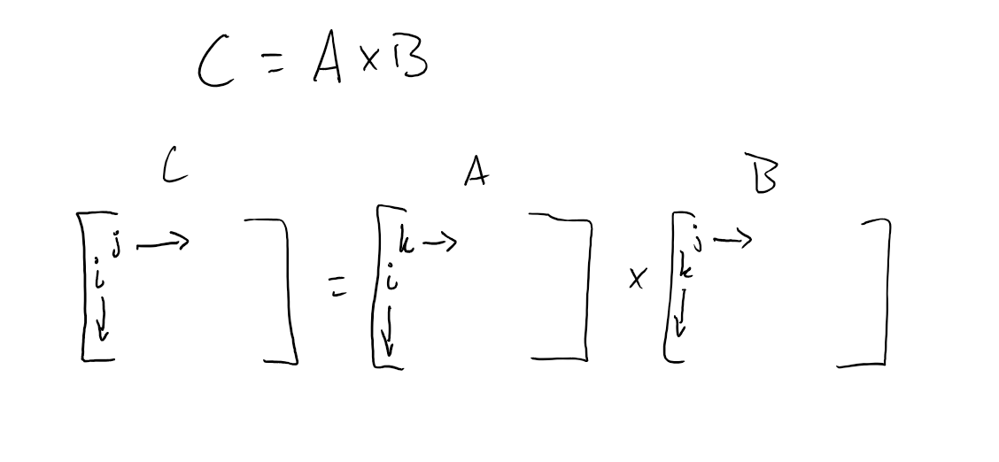
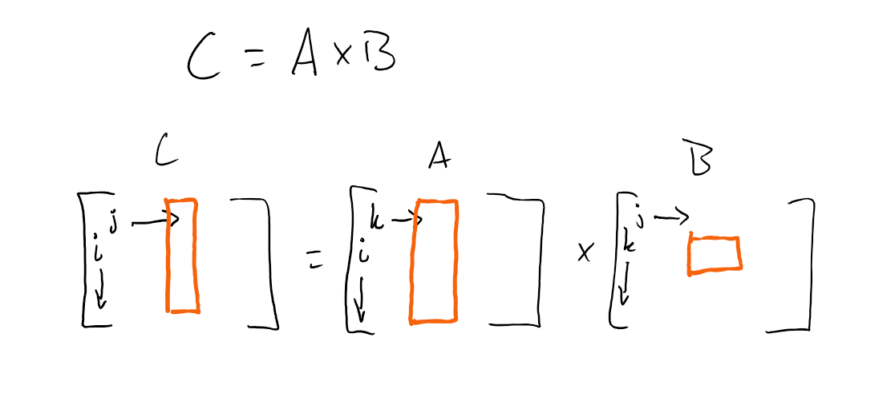

# DINO CPU Assignment 5: Matrix multiplication

**Due by 11:59 PM on March 12, 2021.**

**Turn in via Gradescope**
[See below for details.](#Submission)

## Table of Contents

* [Introduction](#introduction)
* [Base matrix multiplication algorithm](#base-matrix-multiplication-algorithm)
* [Part I: loop interchange](#part-i-loop-interchange)
* [Part II: blocking](#part-ii-blocking)
* [Part III: parallelism](#part-iii-parallelism)
* [Grading](#grading)
* [Submission](#submission)
  * [Code portion](#code-portion)
  * [Written portion](#written-portion)
* [Academic misconduct reminder](#academic-misconduct-reminder)
* [Hints](#hints)

## Introduction

In this assignment, you will explore different implementation of matrix multiplication.
You will experiment with different memory access patterns and parallelism to find the best implementation on modern processors.

**Make sure you run all of your tests on the CSIF machines**
If you use your own machine, you may not get "reasonable" answers for the inputs sizes given below.

**There is a video explaning matrix multiplication, blocking and OpenMP in this [link](https://video.ucdavis.edu/media/Lab%205%20-%20OpenMP%20and%20Blocking/0_rd4p9fdy).**

Please watch the video as you're doing this assignment and it will help you understand matrix multiplication, blocking and how you should incorporate OpenMP in your code.

## Base matrix multiplication algorithm

Below is a simple implementation of matrix multiplication given in [mm.cpp](mm.cpp).

```cpp
void serial_multiply(double **A, double **B, double **C, int size)
{
    for (int i = 0; i < size; i++) {
        for (int j = 0; j < size; j++) {
            for (int k = 0; k < size; k++) {
                C[i][j] += A[i][k] * B[k][j];
            }
        }
    }
}
```

This algorithm is shown in the figure below.



## Part I: loop interchange

**Question 1: What order should the loops be in to get the best performance?**

You can reorder the loops above (e.g., `for i`, `for j`, `for k`, as shown above, or they could be in another order like `for j`, `for i`, `for k`).

Run the matrix multiplication with an input matrix size of 256. Which order give the best performance. Why do you think this is? (Talk about *locality* in your answer.)

## Part II: blocking

You can improve the cache behavior of matrix multiplication by using a blocked algorithm.
In this algorithm, rather than streaming through all of the inputs, you operate on a *block* at a time.


Similar to loop interchange, there are multiple different ways you can choose to block the matrix multiplication algorithm.
One example is shown below where `k` and `j` are blocked and `i` is streamed.



Implement different blocking algorithms for the matrix multiplication.

**Note:** The video mentioned in the introduction is very helpful for this part [link](https://video.ucdavis.edu/media/Lab%205%20-%20OpenMP%20and%20Blocking/0_rd4p9fdy).

**Question 2a: What is the best variables (`i,j`, `j,k`, or `i,k`) to block?**

Use a block size of 64 and an input size of 1024 (should take less than 20 seconds in the worst case).

**Question 2b: How much performance improvement does the blocked algorithm give for the following matrix sizes?**

Note: a `double` is 8 bytes. You can ignore the overhead of the pointers in the double pointer implementation of the matrix datastructure.

- 64x64
- 128x128
- 1024x1024

**Question 2c: What is the *working set size* for these inputs (64x64, 128x128, and 1024x1024)?**

**Question 2d: What is the size of the last-level cache of the CSIF machine?**

You can find out the specific CPU model by running `cat /proc/cpuinfo` and looking at the "model name".
Then, you can use the [Intel website](https://ark.intel.com/), <https://ark.intel.com/> to look up information about that CPU model.

**Question 2e: Given the LLC size, why does the largest matrix gets the most performance improvement from blocking?**

Explain this answer in terms of working set set, LLC size, and *locality*.

## Part III: parallelism

For this part, you will be using [OpenMP](https://computing.llnl.gov/tutorials/openMP/) to parallelize matrix multiplication.

OpenMP is nice, because it's so simple for programmers.
All you have to do is add the following line before a for loop and the compiler will automatically parallelize the loop for you.

```cpp
#pragma omp parallel for
for (...) {
    ...
}
```

**Question 3a: What is the right loop to parallelize?**

In other words, which loop iterations are independent?
Play around with different loops to use with `omp parallel for` and find out which ones a) give the fastest result and b) which ones cause the validation to fail.

**Question 3b: When parallelizing some loops, the validation fails. Why?**

**Question 3c: What is the speedup from your parallelization?**

Run with an input size of 1024 using your best blocked implementation.

Note: You should see significant speedup.

**Question 3d: What is the performance with 1-8 threads?**

Check the speedup with 1 to 8 *threads*.
You can control the number of threads by prepending `OMP_NUM_THREADS=<X>` before your command.

Below shows an example of running the program `mm` with an input of 1024x1024 with 2 threads.

```sh
> OMP_NUM_THREADS=2 ./mm 1024
```

**Question 3e: Explain the pattern you see in 3d based on the CPU model.**

On [Intel's website](https://ark.intel.com/) that you used above, it also tells you the number of cores and the number of "threads" (hardware or "hyper" threads) in the processor.
(These threads are *not* the same as the operating system threads.
They are hardware contexts.)

Use this information to explain the pattern you see in your answer to 3d.

## Grading

Grading will be done automatically on Gradescope.
See [the Submission section](#Submission) for more information on how to submit to Gradescope.

| Name         | Percentage |
|--------------|------------|
| Part I       | 20%        |
| Part II      | 40%        |
| Part III     | 40%        |

## Submission

**Warning**: read the submission instructions carefully.
Failure to adhere to the instructions will result in a loss of points.

### Code portion

You will upload your final matrix multiplication code to [Gradescope]().
However, the code will not be tested.

If you don't upload your code, you will not get any credit for the answers to the questions.

### Written portion

You will upload your answers for the `Assignment 5: Written` assignment to Gradescope.
**Please upload a separate page for each part!**
Additionally, I believe Gradescope allows you to circle the area with your final answer.
Make sure to do this!

We will not grade any questions for which we cannot read.
Be sure to check your submission to make sure it's legible, right-side-up, etc.

## Academic misconduct reminder

You are to work on this project **individually**.
You may discuss *high level concepts* with one another (e.g., talking about the diagram), but all work must be completed on your own.

**Remember, DO NOT POST YOUR CODE PUBLICLY ON GITHUB!**
Any code found on GitHub that is not the base template you are given will be reported to SJA.
If you want to sidestep this problem entirely, don't create a public fork and instead create a private repository to store your work.
GitHub now allows everybody to create unlimited private repositories for up to three collaborators, and you shouldn't have *any* collaborators for your code in this class.
